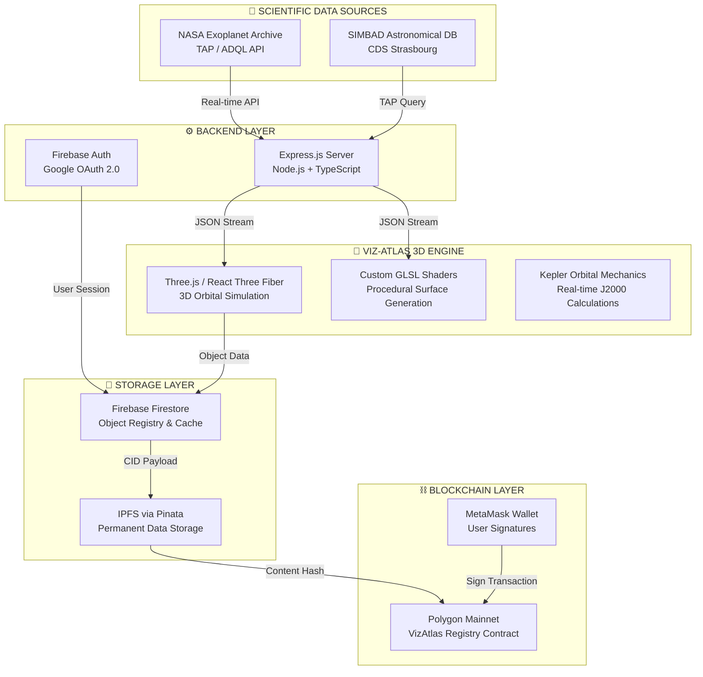

# 🌌 Viz-Atlas — The Decentralized Cosmic Atlas

> **The first community-built, blockchain-verified cosmic atlas**  
> powered by real NASA & SIMBAD data. Created in Ukraine 🇺🇦

---

## ✨ What is Viz-Atlas?

Humanity has catalogued millions of cosmic objects —  
yet no tool allowed a researcher, student, or enthusiast  
to **personally visualize, claim authorship of, and permanently  
record** a verified celestial body on a decentralized ledger.

**Viz-Atlas changes that.**

| Action | What it means |
|--------|--------------|
| 🔭 **Discover** | Search and verify real objects from NASA Exoplanet Archive & SIMBAD |
| 🌌 **Visualize** | Build interactive 3D simulations with custom GLSL shaders |
| ⛓️ **Immortalize** | Record your discovery on Polygon blockchain via IPFS — forever |
| 📜 **Certify** | Receive a cryptographic Certificate of Cosmic Registration |

---

## 🏗️ Architecture Overview

---

## 🛠️ Tech Stack

| Layer | Technologies | Details |
|-------|-------------|---------|
| **Frontend Core** | React 18, Vite, TypeScript | High-performance component architecture |
| **3D Engine** | Three.js, @react-three/fiber, @react-three/drei | Real-time orbital simulation |
| **GPU Shaders** | Custom GLSL, Perlin/Simplex Noise | Procedural planetary surfaces & atmospheres |
| **Database** | Firebase Firestore, Firebase Auth | Secure object registry & user profiles |
| **Scientific APIs** | NASA Exoplanet Archive, SIMBAD TAP | ADQL astronomical data queries |
| **Decentralized Storage** | IPFS via Pinata | Permanent, portable data payloads |
| **Blockchain** | Polygon Mainnet, Ethers.js | Immutable authorship registry |
| **Wallet** | MetaMask integration | Transaction signing |
| **Payments** | NOWPayments (USDT TRC-20) | Crypto subscription processing |

---

## 🪐 Key Features

### 🔬 Scientific Accuracy
- Verifies every object against **NASA Exoplanet Archive** and **SIMBAD**
- Only confirmed, peer-reviewed celestial bodies can be registered
- Real astronomical coordinates, mass, distance, spectral type

### 🌌 3D Visualization Engine
- Procedural planet surfaces generated via **custom GLSL shaders**
- Accurate orbital mechanics using **Kepler's Laws** and J2000 epoch
- Logarithmic camera depth for seamless navigation from moons to galaxies
- Supported object types: stars, exoplanets, galaxies, nebulae, pulsars,  
  quasars, supernovae, black holes, and more

### ⛓️ Blockchain Registry
- Every discovery permanently recorded on **Polygon Mainnet**
- IPFS payload contains full scientific data structured for future portability  
  *(orbital archives, crystalline storage, quantum memory)*
- On-chain version history — scientific updates recorded as new versions
- **Digital Passport PDF** generated for every registered object

### 👤 Community & Authorship
- One object — one first author — forever on-chain
- **Author's Note** — personal scientific thoughts or dedications
- Collaboration system for multi-user object editing
- Global quota protection for rare exoplanets (60% limit rule)

---

## 📐 Mathematical Foundation

Orbital positions are computed in real-time using **classical Kepler mechanics**  
with trigonometric transformations to J2000 epoch:
Custom **logarithmic depth camera** enables seamless transitions  
from small moons to deep-space structures without z-fighting.

---

## 📜 Smart Contract

**VizAtlas Cosmic Registry Protocol v1.0**
Contract:  VizAtlasRegistry
Network:   Polygon Mainnet (Chain ID: 137)
Address:   0x013164EA0570675650051FA302992f64c5c258d9
Standard:  Custom Registry (not ERC-721 — no NFT transfer)
License:   MIT

**Key contract functions:**
- `registerObject()` — record verified cosmic object on-chain
- `getLatestRecord()` — retrieve most recent version
- `getObjectHistory()` — full version history with pagination
- `getProtocolInfo()` — immutable founders and metadata
- `setPaused()` — emergency stop (owner only)

Contract source: [`/src/contracts/VizAtlasRegistry.sol`](./src/contracts/VizAtlasRegistry.sol)

**Encoded in the contract (immutable):**
PROJECT_NAME:       "Viz-Atlas"
ORIGIN_COUNTRY:     "Ukraine"
FOUNDING_YEAR:      2026
FOUNDER_PRIMARY:    "Dmytro Pavliuk"
FOUNDER_SECONDARY:  "Liubomyr Pavliuk"

---

## 🗺️ Roadmap

| Version | Feature | Status |
|---------|---------|--------|
| **v1.0** | Core Atlas — NASA/SIMBAD + Blockchain Registry | ✅ **Live** |
| **v1.1** | EDU Platform — Classroom simulations & assignments | 📋 Planned Q4 2026 |
| **v1.2** | SCI-Vault — Community astrophysics formula database | 📋 Planned 2027 | 
| **v1.3** | Trajectory Lab — Real-time comet & asteroid paths | 📋 Planned 2027 |

---

## 👥 Founding Team

### Dmytro Pavliuk — Lead Visionary & Architect
`React` `Three.js` `GLSL` `Web3` `Blockchain` `Node.js`
> System architect, 3D engine developer, smart contract author,  
> NASA/SIMBAD API integration, blockchain integration.

### Liubomyr Pavliuk — Co-Founder & Research Coordinator  
`NASA` `SIMBAD` `Research` `UI/UX` `AI Testing`
> Scientific data coordination, NASA Exoplanet Archive analysis,  
> SIMBAD TAP query research, UI/UX feedback, AI module testing.

**On-chain authorship:**  
Both founders are permanently recorded in the  
[VizAtlas Smart Contract](https://polygonscan.com/address/0x013164EA0570675650051FA302992f64c5c258d9)  
as `FOUNDER_PRIMARY` and `FOUNDER_SECONDARY` constants.

---

## 🤖 AI-Assisted Development
This project was built using **AI-Assisted Engineering** —  
a modern development approach where human architects  
guide AI tools as expert coding assistants.

**Human responsibilities (Dmytro & Liubomyr):**
- System architecture and module design
- Kepler orbital mathematics and physics algorithms
- Smart contract logic and security model
- Business model, monetization strategy
- Scientific accuracy validation
- All product decisions and vision

**AI assistance (Google Gemini AI Studio):**
- UI component implementation and Three.js optimizations
- Multi-language localization (UA/EN)
- Boilerplate code generation and refactoring
- Style implementation from design specifications

> *This hybrid approach enabled a two-person team to build  
> a production-grade Web3/3D system in record time —  
> demonstrating effective AI-Assisted Engineering.*

---

## ⚖️ License & Rights
MIT License — Open for the world.
© 2026 Viz-Atlas · Dmytro Pavliuk & Liubomyr Pavliuk
All intellectual property rights reserved by the Founding Authors
and their lawful heirs, indefinitely.
Community participants who register objects receive permanent
on-chain authorship attribution but do not acquire ownership
rights over the Protocol or its code.

---

## 🌐 Links

| Resource | URL |
|----------|-----|
| 🚀 Live Application | [vizatlas.space](https://vizatlas.space) |
| ⛓️ Smart Contract | [Polygonscan](https://polygonscan.com/address/0x013164EA0570675650051FA302992f64c5c258d9) |
| ☕ Support | [Ko-fi](https://ko-fi.com/vizatlasdmytro) |

---

**Built for the stars — for all of humanity** 🌌

*© 2026 Viz-Atlas · Created in Ukraine 🇺🇦 · MIT License*

